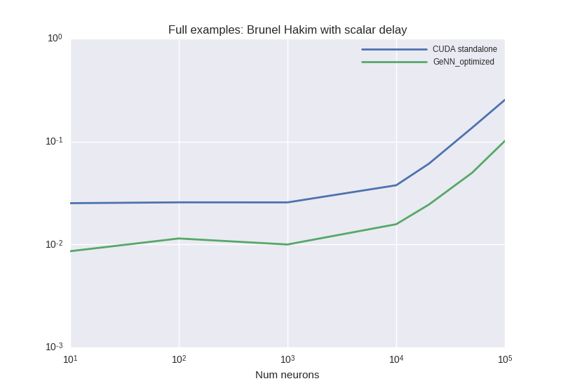
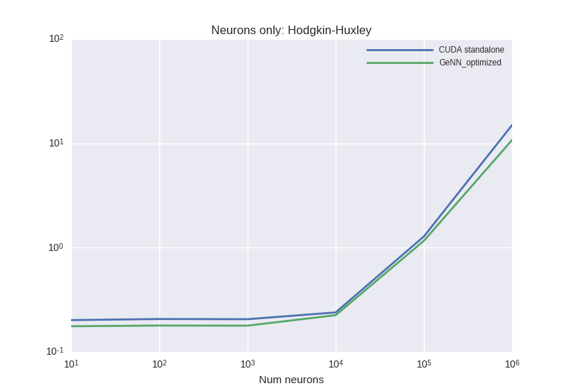
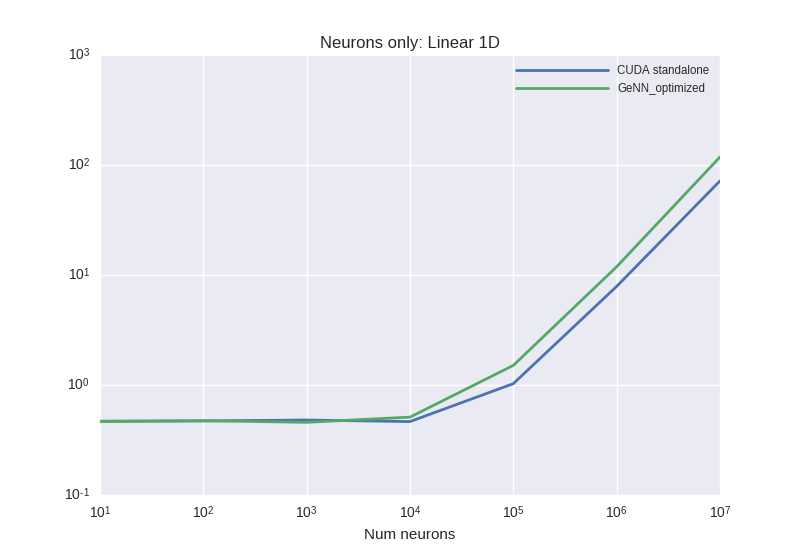

# Benchmark results from 16.03.2017
## Description:
These speed tests are run without clock synchronization (btwn host and device at each clock cycle) and random nunmbers are not generated at each clock cycle but instead a total of 50MB worth of random nubmers is always generated at once and then regenerated when they are used up. Both decrease overhead significantly.


## Last git log:
```
commit 0b913c2e7eddb2dc60fc94422f8a588d7e652094
Author: Denis Alevi <mail@denisalevi.de>
Date:   Thu Mar 16 00:21:22 2017 +0100

    Remove clock synchronization (host->device)

    Clock synchronisation creates significant overhead for small networks
    and we could just pass the time values as kernel argument where needed.
    This currently breaks the spikemonitor though, since the time is inside
    the 'vector_code' block...

```
There is also a `git diff` saved in the current directory.

## Results

### BrunelHakimModelScalarDelay



<details><summary>Examplary `nvprof` results for **CUDAStandaloneConfiguration**</summary><p>
Profile summary for `N = 1000`:

```
==10779== NVPROF is profiling process 10779, command: ./main
==10779== Profiling application: ./main
==10779== Profiling result:
Time(%)      Time     Calls       Avg       Min       Max  Name
 31.97%  5.2307ms      1000  5.2300us  3.0080us  24.768us  kernel_synapses_pre_codeobject(unsigned int, unsigned int, unsigned int, int*, unsigned int, double*, int, int*, int, double*, int*, int, double*, int*)
 28.15%  4.6051ms      1000  4.6050us  4.4160us  7.2960us  kernel_neurongroup_stateupdater_codeobject(unsigned int, unsigned int, double*, double*, double*, double*, bool*)
 18.97%  3.1038ms      1000  3.1030us  3.0400us  3.4880us  [CUDA memset]
 11.52%  1.8849ms      1000  1.8840us  1.7280us  2.3680us  kernel_neurongroup_thresholder_codeobject(unsigned int, unsigned int, int*, double*, double*, double*, bool*)
  8.80%  1.4396ms      1000  1.4390us  1.3760us  1.7280us  kernel_neurongroup_resetter_codeobject(unsigned int, unsigned int, double*, int*)
  0.57%  93.696us         1  93.696us  93.696us  93.696us  void gen_sequenced<curandStateXORWOW, float2, normal_args_st, __operator_&__(float2 curand_normal_scaled2<curandStateXORWOW>(curandStateXORWOW*, normal_args_st))>(curandStateXORWOW*, float2*, unsigned long, unsigned long, normal_args_st)
  0.01%     992ns         1     992ns     992ns     992ns  [CUDA memcpy HtoD]

==10779== API calls:
Time(%)      Time     Calls       Avg       Min       Max  Name
 68.56%  41.193ms      4001  10.295us  8.1630us  6.3986ms  cudaLaunch
 14.58%  8.7623ms      1000  8.7620us  8.3720us  16.048us  cudaMemset
 10.68%  6.4182ms     32005     200ns     175ns  333.32us  cudaSetupArgument
  2.71%  1.6288ms      4001     407ns     272ns  337.56us  cudaConfigureCall
  1.98%  1.1896ms      4002     297ns     269ns  1.3110us  cudaGetLastError
  1.14%  687.80us         1  687.80us  687.80us  687.80us  cudaMemcpyToSymbol
  0.22%  134.43us         1  134.43us  134.43us  134.43us  cudaMalloc
  0.09%  52.439us         1  52.439us  52.439us  52.439us  cudaMemGetInfo
  0.02%  13.619us         4  3.4040us  2.8310us  5.0310us  cudaFuncGetAttributes

```

</p></details>


***

### HHNeuronsOnly



<details><summary>Examplary `nvprof` results for **CUDAStandaloneConfiguration**</summary><p>
Profile summary for `N = 1000`:

```
==21055== NVPROF is profiling process 21055, command: ./main
==21055== Profiling application: ./main
==21055== Profiling result:
Time(%)      Time     Calls       Avg       Min       Max  Name
 72.65%  124.77ms     10000  12.476us  10.880us  15.104us  kernel_neurongroup_stateupdater_codeobject(unsigned int, unsigned int, double*, double*, bool*, double*, double*, double*, double*)
 17.67%  30.335ms     10000  3.0330us  2.8160us  3.5200us  [CUDA memset]
  9.68%  16.623ms     10000  1.6620us  1.4400us  2.6240us  kernel_neurongroup_thresholder_codeobject(unsigned int, unsigned int, int*, double*, double*, double*, bool*)

==21055== API calls:
Time(%)      Time     Calls       Avg       Min       Max  Name
 58.37%  173.72ms     20000  8.6850us  7.9340us  5.6808ms  cudaLaunch
 28.36%  84.417ms     10000  8.4410us  7.9390us  77.003us  cudaMemset
  9.48%  28.208ms    160000     176ns     145ns  313.53us  cudaSetupArgument
  1.99%  5.9225ms     20000     296ns     222ns  312.64us  cudaConfigureCall
  1.78%  5.3035ms     20000     265ns     227ns  320.86us  cudaGetLastError
  0.02%  46.914us         1  46.914us  46.914us  46.914us  cudaMemGetInfo
  0.00%  7.0510us         2  3.5250us  3.4680us  3.5830us  cudaFuncGetAttributes

```

</p></details>


***

### LinearNeuronsOnly



<details><summary>Examplary `nvprof` results for **CUDAStandaloneConfiguration**</summary><p>
Profile summary for `N = 1000`:

```
==16770== NVPROF is profiling process 16770, command: ./main
==16770== Profiling application: ./main
==16770== Profiling result:
Time(%)      Time     Calls       Avg       Min       Max  Name
100.00%  200.62ms    100000  2.0060us  1.9520us  3.1360us  kernel_neurongroup_stateupdater_codeobject(unsigned int, unsigned int, double*, double*)

==16770== API calls:
Time(%)      Time     Calls       Avg       Min       Max  Name
 86.29%  839.42ms    100000  8.3940us  7.8810us  8.5752ms  cudaLaunch
  8.58%  83.459ms    400000     208ns     150ns  348.82us  cudaSetupArgument
  2.59%  25.203ms    100000     252ns     214ns  9.5060us  cudaConfigureCall
  2.53%  24.602ms    100000     246ns     217ns  9.4530us  cudaGetLastError
  0.01%  69.953us         1  69.953us  69.953us  69.953us  cudaMemGetInfo
  0.00%  10.821us         1  10.821us  10.821us  10.821us  cudaFuncGetAttributes

```

</p></details>
